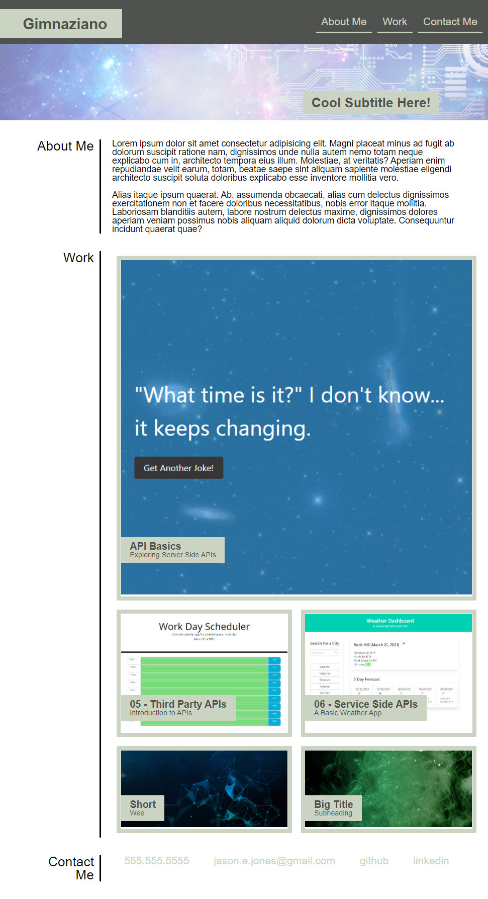

# 8: Responsive Portfolio
Due Date: 3/20/2021 @ 11:59 PM

Coding Bootcamp Homework Assignment #2
# 08 Portfolio Update
The primary objective of this homework assignment is to update the portfolio with the work we have completed to date.

## Screenshots
* Fullscreen

## Links
* This repo is located [on github](https://github.com/jonesjsc/08-Homework-Updated-Portfolio)
* This site is deployed on [github pages](https://jonesjsc.github.io/08-Homework-Updated-Portfolio/)